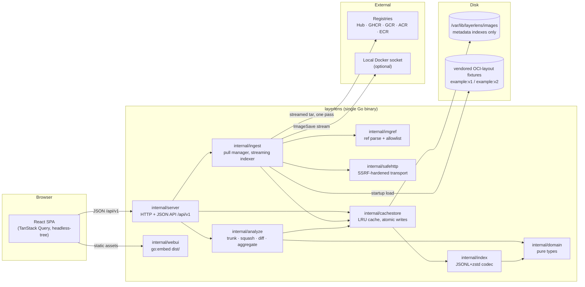

# ARCHITECTURE.md — layerlens

Technical architecture for layerlens: a single Go binary serving a JSON API and an
embedded React SPA that diffs two Docker/OCI images — shared-layer trunk, dotted
"could-be-shared" edges, and a unified cumulative-filesystem diff between two
selected layer points.

Inputs: `.planning/PROJECT.md` (spec), `.planning/DECISIONS.md` (verified library
choices — treated as settled), `.planning/RESEARCH.md` (binding user answers).
Library signatures cited below were re-verified against
`go-containerregistry v0.22.0`, `github.com/docker/docker/client`, and
`klauspost/compress/zstd` via `go doc` on 2026-08-29.

---

## 1. System overview

### 1.1 Components



Key property: **no extracted filesystems and no stored blobs**. Every layer tar is
streamed exactly once (from registry, daemon, or fixture layout) into a small
per-layer *metadata index* keyed by DiffID. All views — layer graph, cumulative
trees, diffs, aggregates — are computed from these indexes.

### 1.2 Request lifecycle for the golden workflow

1. **Startup**: binary takes `flock` on the cache root, loads vendored OCI-layout
   fixtures (`example:v1`, `example:v2`) from the fixtures directory, ingests any
   whose layers are not yet indexed (marked *pinned* — never LRU-evicted). Startup
   succeeds with zero network.
2. `GET /api/v1/images` → SPA renders the cached-image picker; user selects
   `example:v1` (left) and `example:v2` (right); SPA navigates to
   `/compare?left=<idA>&right=<idB>`.
3. `GET /api/v1/diff/layers?left=&right=` → server computes the longest common
   prefix of the two `rootfs.diff_ids` arrays (trunk), the two branches, and
   could-be-shared edges from stored normalized changeset digests. Pure metadata;
   ~ms. SPA draws the fork diagram.
4. User picks a layer in each branch → SPA sets `l=<n>&r=<m>` in the URL and
   requests `GET /api/v1/diff/tree?left=&right=&leftLayers=n&rightLayers=m&path=/`.
5. Server assembles (or fetches from its in-memory comparison LRU) the two squashed
   cumulative trees, diffs them into one unified tree with bottom-up aggregates,
   and returns the first page of root children. Expanding a folder issues the same
   endpoint with `path=/that/dir`; drill-down re-roots on `path`.
6. User pastes `ghcr.io/foo/bar:tag` → `POST /api/v1/pulls` validates the reference
   against the allowlist, returns a pull id; SPA polls `GET /api/v1/pulls/{id}`
   for per-layer byte progress; `DELETE` cancels. On completion the image appears
   in `GET /api/v1/images`.

### 1.3 Process and deployment model

- One statically linked Go binary (`CGO_ENABLED=0`, cross-compiled
  `GOOS=linux GOARCH=amd64`), SPA embedded via `//go:embed dist`.
- Flags/env: `--listen` (default `:8080`), `--data-dir` (default
  `/var/lib/layerlens/images`), `--cache-max-bytes` (default 50 GiB),
  `--fixtures-dir` (default: embedded-adjacent `fixtures/`), `--docker-host`
  (default: `DOCKER_HOST` / `/var/run/docker.sock` autodetect), `--ui-dir`
  (development only, default empty: serve SPA assets from this directory
  instead of the embedded copy, so `mise run dev`'s esbuild/Tailwind watchers
  are visible without recompiling the binary).
- systemd unit: dedicated `layerlens` user, `StateDirectory=layerlens`,
  `ProtectSystem=strict`, `NoNewPrivileges=yes`, `PrivateTmp=yes`,
  `Restart=on-failure`. `mise run deploy` scp's binary + unit + fixtures, then
  `systemctl daemon-reload && systemctl restart layerlens`; dry-run mode prints
  the exact commands (per RESEARCH Q1, deploy is built, not run).
- Exactly one server process per cache root, enforced by an exclusive advisory
  `flock` on `<root>/lock` at startup (fail fast with a clear error).
- `GET /healthz` returns 200 once fixtures are loaded (used by Playwright
  `webServer` and systemd `ExecStartPost` checks).

---

## 2. Go package layout

```
cmd/
  layerlens/        main: flag parsing, wiring, embed, graceful shutdown
  genfixtures/      deterministic OCI-layout fixture generator (see §9.2)
internal/
  domain/           pure core types: digests, refs, layers, entries, trees, diff nodes.
                    Imports: stdlib only. No gcr, no net/http.
  analyze/          pure algorithms over domain types: history mapping, trunk LCP,
                    changeset digest, streaming layer indexer, squash, diff,
                    aggregation, could-be-shared.
                    Imports: domain, klauspost/zstd. (The indexer of §4.1 owns
                    media-type decompression, so it needs a zstd decoder; still
                    no gcr, no net/http.)
  index/            JSONL+zstd (de)serialization of per-layer indexes and image
                    records; schema versioning. Imports: domain, klauspost/zstd.
  cachestore/       on-disk cache under --data-dir: layout, atomic write/rename,
                    LRU accounting + eviction, pinning, flock. Imports: domain, index.
  imgref/           parse + validate user references against the registry allowlist.
                    Imports: domain, gcr pkg/name. (gcr types do NOT escape.)
  safehttp/         SSRF-hardened *http.Transport (custom DialContext, redirect cap,
                    body limits). Imports: stdlib net, net/http.
  ingest/           image sources & pull manager: registry (gcr remote), docker
                    daemon (moby client ImageSave), OCI layout dir (gcr layout/
                    tarball); one streaming pass per layer → domain entries →
                    cachestore. Progress + cancellation. Imports: domain, analyze
                    (changeset digest), index, cachestore, imgref, safehttp, gcr,
                    docker client.
  server/           HTTP handlers, DTO types, pagination, in-memory comparison LRU,
                    error envelope. Imports: domain, analyze, cachestore, ingest, imgref.
  webui/            embed.FS of built SPA + SPA-fallback file server.
web/                TypeScript SPA (esbuild + Tailwind v4 CLI; see §8)
fixtures/           vendored OCI-layout images produced by cmd/genfixtures
deploy/             systemd unit, deploy script
```

Dependency direction (arrows = "imports"):

```
server ─→ analyze ─→ domain
server ─→ ingest ─→ {imgref, safehttp, index, cachestore, analyze}
server ─→ cachestore ─→ index ─→ domain
ingest ─→ gcr / docker client        (ONLY ingest and imgref import gcr/moby)
```

`domain` and `analyze` are free of HTTP and of go-containerregistry types — every
algorithm in §4 is unit-testable with hand-built structs.

### 2.1 Boundary interfaces

Defined in `domain` (consumed by `analyze`/`server`, implemented by `cachestore`
and `ingest`):

```go
// LayerIndexSource yields the stored per-layer changeset for a DiffID.
type LayerIndexSource interface {
    LayerIndex(ctx context.Context, diffID Digest) (*LayerIndex, error) // ErrNotIndexed if absent
}

// ImageStore lists and fetches analyzed-image records.
type ImageStore interface {
    Images(ctx context.Context) ([]ImageRecord, error)
    Image(ctx context.Context, id Digest) (*ImageRecord, error) // ErrNotFound
    Touch(ctx context.Context, id Digest) error                 // LRU bump (debounced by impl)
}

// Ingester is what the HTTP layer sees of pulling/analyzing.
type Ingester interface {
    Start(ctx context.Context, req IngestRequest) (PullID, error) // validates, dedupes in-flight
    Status(id PullID) (*PullStatus, error)
    Cancel(id PullID) error
    ListDockerImages(ctx context.Context) (DockerListing, error)
}
```

`ingest` internally adapts `v1.Layer.Compressed()` / `client.ImageSave` streams
into calls on a pure `indexer` (in `analyze`) that consumes
`(tar.Header-shaped domain struct, io.Reader)` pairs — so the tar/whiteout/hashing
logic is testable from in-memory tars without gcr.

---

## 3. Core domain model

All digests are the canonical string form `sha256:<64 lowercase hex>`:

```go
type Digest string // validated: ^sha256:[a-f0-9]{64}$

// ImageRef — a parsed, allowlist-validated user reference (imgref output).
type ImageRef struct {
    Raw        string // as typed
    Registry   string // e.g. "index.docker.io", "ghcr.io"
    Repository string // e.g. "library/alpine"
    Tag        string // "" if digest-only
    Digest     Digest // "" if tag-only
}

// ImageRecord — a fully analyzed image (the cache's unit of retention).
type ImageRecord struct {
    ID             Digest    // config blob digest == image ID. Canonical identity everywhere.
    ManifestDigest Digest    // platform manifest digest (what `docker pull` prints)
    RefNames       []string  // display references ("example:v1", "ghcr.io/x/y:z")
    Source         string    // "fixture" | "registry" | "docker"
    Platform       string    // always "linux/amd64"
    CreatedAt      time.Time // image config .created
    IngestedAt     time.Time
    LastUsedAt     time.Time // LRU clock
    Pinned         bool      // fixtures: never evicted
    Layers         []Layer   // ordered, non-empty history entries only (see below)
    TotalBytes     int64     // sum of layer uncompressed content bytes
}

// Layer — one entry of rootfs.diff_ids plus derived identities and its instruction.
type Layer struct {
    Index            int    // position in rootfs.diff_ids (0-based)
    DiffID           Digest // uncompressed tar digest — drives trunk/ChainID logic
    ChainID          Digest // ChainID(L0..Li), precomputed at ingest
    CompressedDigest Digest // manifest layers[i].digest; "" for daemon-save without manifest
    CompressedSize   int64  // manifest size; 0 if unknown
    ContentBytes     int64  // sum of regular-file sizes in this layer's changeset
    EntryCount       int    // changeset entries (incl. whiteouts)
    ChangesetDigest  Digest // normalized changeset digest (§3.1) — NEVER shown as a cache hit
    Instruction      string // cleaned created_by ("" if unknown)
    InstructionRaw   string // verbatim created_by
    InstructionKnown bool   // false when history↔diff_ids counts disagree (fallback, §4.0)
}

// HistoryEntry — pure mirror of OCI config history (for analyze.MapHistory).
type HistoryEntry struct {
    CreatedBy  string
    Comment    string
    EmptyLayer bool
}
```

**Which identifier is used where — the rulebook:**

| Purpose | Identifier |
|---|---|
| Image identity (API paths, cache keys, URLs) | config digest (`ImageRecord.ID`) |
| Shared trunk / "shares a layer cache" | equal **DiffID prefix** ⇔ equal ChainID chain |
| Layer index storage key (cross-image dedupe) | **DiffID** |
| Dotted "could-be-shared" edges | **normalized ChangesetDigest** equality |
| Registry blob dedupe (display-only footnote) | CompressedDigest |

The trunk is **never** computed from compressed manifest digests (same bytes can be
recompressed), and a ChangesetDigest match is **never** presented as an actual
cache hit — the API labels it `couldBeShared`, a distinct field from `owner:"shared"`.

### 3.1 Per-layer changeset

```go
type EntryKind uint8
const (
    KindFile EntryKind = iota
    KindDir
    KindSymlink
    KindHardlink
    KindDevice   // block+char collapsed; Size 0
    KindFifo
    KindWhiteout  // ".wh.<name>" — Path is the *target* path being deleted
    KindOpaque    // ".wh..wh..opq" — Path is the directory being made opaque
)

type Entry struct {
    Path       string    // cleaned, "/"-rooted, no trailing slash ("/usr/lib/x.so")
    Kind       EntryKind
    Mode       uint32    // permission bits + setuid/setgid/sticky (lower 12 bits of tar mode)
    UID, GID   int       // INCLUDED in ChangesetDigest (Docker build-cache rule)
    Uname,Gname string    // tar uname/gname; INCLUDED in ChangesetDigest
    Devmajor, Devminor int64 // device nodes; INCLUDED in ChangesetDigest
    Xattrs     map[string]string // sorted at hash time; INCLUDED in ChangesetDigest
    Size       int64     // regular files only; hardlinks 0
    MtimeUnix  int64     // stored for display; EXCLUDED from ChangesetDigest (the ONLY
                          // excluded field — mirrors BuildKit's v1TarHeaderSelect)
    LinkTarget string    // symlink target (verbatim) or hardlink target path (cleaned)
    ContentSHA Digest    // regular files only, hashed during the streaming pass
}

type LayerIndex struct {
    SchemaVersion   int
    DiffID          Digest
    ChangesetDigest Digest
    ContentBytes    int64
    Entries         []Entry // ordered by (Path, Kind): at most one filesystem object per
                            // path (last-in-tar wins) plus, independently, at most one
                            // whiteout and one opaque marker for that path (§4.2)
    Warnings        []string // e.g. sanitized-away tar entries
}
```

**Normalized changeset digest** (RESEARCH **Q9**, binding — supersedes Q5): the field
set is **tarsum v1**, i.e. exactly what Docker/BuildKit hashes for its *build* cache.
Verified against `moby/buildkit` `cache/contenthash/{filehash,tarsum.go}`:
`v1TarHeaderSelect` emits `{name, mode, uid, gid, size, typeflag, linkname, uname,
gname, devmajor, devminor}` + sorted `SCHILY.xattr.*` records, explicitly *"excluding
the 'mtime' header"*, and the file's content is streamed into the same hash.

**mtime is the only excluded field. uid/gid ARE included** (this reverses the earlier
Q5 answer). SHA-256 over the canonical serialization of the sorted entries, where each
entry contributes exactly

```
(Path, Kind /* typeflag */, Mode /* 12 permission bits */, UID, GID,
 Uname, Gname, Size, LinkTarget, Devmajor, Devminor,
 Xattrs /* sorted by key, BuildKit's filter: keep "security.capability",
           drop other security.* and system.* */,
 ContentSHA /* regular files only */)
```

length-prefixed fields, one record per entry, in Path order. **`MtimeUnix` is the only
excluded field** — matching `v1TarHeaderSelect`, which copies the v0 list "excluding the
'mtime' header". `Size` is retained even though it is largely redundant with ContentSHA
for regular files, because tarsum v1 includes it and it carries meaning for entry kinds
that have no content hash.

Whiteout and opaque entries participate (their Kind and Path are the payload;
ContentSHA/Mode empty/zero). A digest-scheme version byte prefixes the stream so the
definition can evolve without silently colliding with old digests.

> **Note on fidelity.** We apply tarsum-v1 *field selection* to layer-tar entries;
> BuildKit applies it to build-context files, and its byte-level serialization
> (`"key"+"value"` concatenation) differs from our length-prefixed encoding. We are
> deliberately not trying to reproduce BuildKit's digest values — only its notion of
> *which differences matter*. The UI must therefore say "equivalent under Docker's
> build-cache rule", never "this is a cache hit".

### 3.2 Cumulative (squashed) tree and diff tree

```go
// Node — one path in the cumulative filesystem at a layer point.
type Node struct {
    Name     string
    Kind     EntryKind        // never Whiteout/Opaque (those are consumed by squashing)
    Mode     uint32
    Size     int64
    UID, GID int
    MtimeUnix int64
    LinkTarget string
    ContentSHA Digest
    Implicit bool             // dir created only because a child needed a parent (§4.2)
    Children map[string]*Node // dirs only; nil otherwise
}

type DiffStatus uint8
const (StatusUnchanged DiffStatus = iota; StatusAdded; StatusRemoved; StatusModified)

// SideMeta — flattened per-side metadata copied out of Node (side trees are
// released after the diff is built; DiffNode is self-contained).
type SideMeta struct {
    Kind EntryKind; Mode uint32; Size int64; LinkTarget string; ContentSHA Digest
}

type Agg struct {
    LeftBytes, RightBytes   int64 // regular-file bytes in subtree, per side
    LeftFiles, RightFiles   int64 // regular-file counts, per side
    AddedBytes, RemovedBytes, ModifiedBytesLeft, ModifiedBytesRight int64
    AddedFiles, RemovedFiles, ModifiedFiles int64
}

type DiffNode struct {
    Name     string
    Status   DiffStatus       // for dirs: Modified iff any descendant or own meta changed
    Left     *SideMeta        // nil ⇒ added
    Right    *SideMeta        // nil ⇒ removed
    Agg      Agg              // filled bottom-up; for files, degenerate (own size/count)
    Children []*DiffNode      // sorted: dirs first, then files, each by name
}
```

Modification predicate for a path present on both sides: the **tarsum-v1 field set**
— `Kind (typeflag), Mode (12 bits), UID, GID, Uname, Gname, Size, LinkTarget,
Devmajor, Devminor, Xattrs, ContentSHA` differ ⇒ Modified. Deliberately the same field
set as the changeset digest, so the diff view and the dotted edges never disagree about
what "same" means, and both agree with Docker's own build cache.

**mtime is the only difference that does not mark a file modified** — which is correct
and load-bearing: mtime churn is exactly what breaks DiffID equality between two
otherwise identical rebuilds, and surfacing that as a tree full of "modified" rows
would bury the real changes.

---

## 4. Algorithms

### 4.0 History → layer mapping (in `analyze`, pure)

```
MapHistory(history []HistoryEntry, nLayers int) ([]string /*rawByLayer*/, ok bool):
  cursor := 0
  for h in history (oldest first):
      if h.EmptyLayer: continue          // ENV, LABEL, CMD, WORKDIR, EXPOSE, ...
      if cursor == nLayers: return nil, false   // more non-empty history than layers
      rawByLayer[cursor] = h.CreatedBy; cursor++
  if cursor != nLayers: return nil, false       // fewer than layers (squashed/hand-built)
  return rawByLayer, true
```

On `ok == false` every layer gets `InstructionKnown=false` and empty text — never
a misaligned guess. Display cleaning strips the classic `/bin/sh -c #(nop) ` and
`/bin/sh -c ` prefixes and the trailing ` # buildkit`; `InstructionRaw` keeps the
verbatim string for the tooltip. O(len(history)).

### 4.1 Layer ingestion — one streaming pass, no extraction

Input: an `io.Reader` of the layer's **compressed** blob (registry/daemon/layout)
plus its declared media type and DiffID. No blob and no file content ever touches
disk; only the index does.

```
IndexLayer(compressed io.Reader, mediaType, declaredDiffID, progress *counter):
  cr := countingReader(compressed)              // drives byte-accurate pull progress
  u  := decompressor(mediaType, cr)             // gzip | zstd | none
  dh := sha256.New()                            // DiffID verification
  tr := tar.NewReader(io.TeeReader(u, dh))
  entries := map[string]Entry{}                 // last-in-tar wins per path
  for hdr := range tr:
      p, ok := sanitizePath(hdr.Name)           // §7.3; on !ok: record warning, drain, skip
      base := path.Base(p)
      switch:
        base == ".wh..wh..opq": entries[dirOf(p)] joins as KindOpaque for dirOf(p)
        strings.HasPrefix(base, ".wh."):
            entries[join(dirOf(p), base[4:])] = Entry{Kind: KindWhiteout}
        hdr is regular file:
            h := sha256.New()
            n := io.Copy(h, tr)                 // hash while draining; nothing stored
            entries[p] = entryFrom(hdr, p, KindFile, n, hex(h))
        else: entries[p] = entryFrom(hdr, p, kindOf(hdr), 0, "")

// entryFrom captures every field the tarsum-v1 changeset digest needs (§3.1):
//   Kind/typeflag, Mode (12 bits), UID, GID, Uname, Gname, Size, LinkTarget,
//   Devmajor, Devminor, Xattrs (from hdr.PAXRecords "SCHILY.xattr." prefix,
//   filtered like BuildKit: keep "security.capability", drop other security.*
//   and system.*), plus MtimeUnix which is stored for display only.
  verify sha256(dh) == declaredDiffID           // else fail the ingest: corrupt/tampered
  sorted := sortByPath(entries)
  return LayerIndex{DiffID, ChangesetDigest: digestOf(sorted), sorted, ...}
```

- Time O(layer bytes) dominated by decompression + SHA-256 (~1–2 GB/s/core);
  the per-file hash and the DiffID hash share the single pass.
- Memory O(entries in this one layer): ~200 B/entry ⇒ a pathological 500k-entry
  layer ≈ 100 MB transient, freed after the index is flushed.
- Layers already indexed (DiffID present in cache) are **skipped without
  streaming** on the registry path; on the daemon path the save stream is
  sequential, so known layers are drained cheaply (no hashing) — and when
  `docker inspect` reveals a `RepoDigests` entry on an allowlisted registry, the
  registry path is preferred outright (DECISIONS A2).
- Cancellation: the pull context cancels the underlying HTTP body / save stream;
  partially written staging files are deleted; committed per-layer indexes are
  kept (they are valid and resumable — the durable checkpoint unit is the layer).
- Progress: per-layer `compressedBytesRead / manifest.layers[i].size` (registry;
  exact) or uncompressed-bytes vs `docker inspect` size (daemon; flagged as an
  estimate).

### 4.2 Squashing layers 1..N into a cumulative tree

```
Squash(indexes []LayerIndex) *Node:          // indexes in rootfs order, 0..N-1
  root := dirNode("/")
  for L in indexes:
      // Pass 1 — deletions apply to LOWER state only (spec: whiteouts MUST only
      // apply to lower layers; opaque applied before the layer's own entries,
      // regardless of tar order — guaranteed here by two-pass structure):
      for e in L.Entries where e.Kind == KindOpaque:
          if d := lookup(root, e.Path); d != nil && d.Kind == KindDir:
              d.Children = {}                 // dir node itself survives
          // dir absent in lower layers: no-op (the layer's own dir entry lands in pass 2)
      for e in L.Entries where e.Kind == KindWhiteout:
          removeSubtree(root, e.Path)         // no-op if absent
      // Pass 2 — upserts:
      for e in L.Entries where e.Kind not in {KindWhiteout, KindOpaque}:
          upsert(root, e)
  return root

upsert(root, e):
  parent := ensureDirs(root, dirOf(e.Path))   // implicit parents: KindDir, mode 0755,
                                              // Implicit=true (tars may omit dir headers)
  old := parent.Children[base(e.Path)]
  n   := nodeFrom(e)
  if e.Kind == KindDir:
      if old != nil && old.Kind == KindDir:
          n.Children = old.Children           // re-stating a dir updates meta, KEEPS children
      else: n.Children = {}                   // dir replaces non-dir: fresh subtree
  // non-dir replacing a dir: old.Children dropped wholesale (type change hides
  // the lower subtree, matching overlayfs behavior)
  parent.Children[base(e.Path)] = n
```

Exact semantics pinned down (the edge cases):

- **Opaque + explicit whiteout in the same dir/layer**: pass 1 applies both to the
  lower state; order between them is irrelevant because both only delete.
- **Whiteout of `x` while the same layer also ships `x`**: lower `x` deleted in
  pass 1, this layer's `x` created in pass 2 — the layer's version wins, and the
  changeset still records both entries (they are distinct changes).
- **Opaque marker in a directory the layer also re-creates**: pass 1 clears
  lower children; pass 2's dir entry updates the dir's own metadata without
  resurrecting anything (children-preserving branch sees the already-cleared map).
- **Whiteout/opaque for a nonexistent lower path**: no-op, no error.
- **Duplicate paths inside one tar**: resolved at index time (last wins), so
  squashing never sees them. A marker and a filesystem object for the same path
  are *not* duplicates and both survive indexing: the standard overlay
  representation of an opaque directory is the directory member plus a
  `.wh..wh..opq` member inside it, and the "whiteout x, then ship x" case above
  needs both entries to exist for the two passes to have anything to do.
- **Hardlinks**: kept as `KindHardlink` with `LinkTarget`; `Size` 0 so bytes are
  counted once (at the target). If the target was whiteout-deleted by a later
  layer the link dangles — displayed as-is, never resolved.
- An explicit dir entry replacing an `Implicit` one clears the flag.

Complexity: O(total entries across the N layers) upserts, each O(depth) map hops;
memory O(final tree size). Trees are keyed and cached by
`ChainID(L0..Lk)` in the comparison LRU — two selections sharing a trunk prefix
reuse nothing *across* keys by design (simplicity), but the whole assembled
comparison is reused across paging requests.

### 4.3 Diffing two cumulative trees

```
Diff(l, r *Node) *DiffNode:                   // either may be nil
  case l == nil: return markSubtree(r, StatusAdded)      // recursive; fills Agg
  case r == nil: return markSubtree(l, StatusRemoved)
  d := DiffNode{Name: l.Name, Left: metaOf(l), Right: metaOf(r)}
  if l.Kind == KindDir && r.Kind == KindDir:
      for name in sortedUnion(l.Children, r.Children):   // merge two sorted key sets
          d.Children += Diff(l.Children[name], r.Children[name])
      ownChanged := metaDiffers(l, r)          // metadata only, and skipped if either
                                               //   side is an Implicit dir
      d.Status = Modified if ownChanged or any child != Unchanged else Unchanged
  else:
      d.Status = Modified if metaDiffers(l, r) else Unchanged
      // metaDiffers: the tarsum-v1 field set — see §3.2. Directories are
      // projected with Size/ContentSHA forced to zero (they have neither), so
      // one predicate serves both cases.
  fill d.Agg from children + own contribution  // same post-order visit, §4.4
  return d
```

An `Implicit` dir on either side never counts as a metadata modification (its
0755/uid 0 are synthetic); a *kind* change is still reported. Complexity O(|L| + |R|) node visits; the result is self-contained
(SideMeta copies), so both input trees are garbage the moment Diff returns.

### 4.4 Bottom-up aggregation

Computed inside the same post-order walk (no second pass):

```
for file nodes:      contribute Size/1 to {Left,Right}{Bytes,Files} per present side;
                     Added → AddedBytes/Files; Removed → RemovedBytes/Files;
                     Modified → ModifiedFiles, ModifiedBytesLeft/Right (both sides' sizes)
for dir nodes:       Agg = Σ children Agg   (dirs themselves contribute 0 bytes)
hardlink/symlink/device/fifo: contribute 0 bytes; counted in EntryCount-style file
                     counts? — NO: {Left,Right}Files count regular files only;
                     non-file entries still appear as rows with their own status.
```

O(nodes). The per-directory `Agg` is exactly what the tree API returns per row,
and `max(child.Agg.LeftBytes + child.Agg.RightBytes)` over siblings is the
denominator the API ships for relative size bars (§6.5).

### 4.5 Could-be-shared edges

After trunk length `k` (longest common `diff_ids` prefix — including the edge
cases: `k == 0` (no shared trunk), `k == len(A)` or `len(B)` (strict prefix — one
branch empty), `k == len(A) == len(B)` (identical images — both branches empty)):

```
edges := []
byDigest := multimap{}                       // ChangesetDigest → left branch indexes
for i in k..len(A)-1:
    if A[i].EntryCount > 0: byDigest[A[i].ChangesetDigest] += i
for j in k..len(B)-1:
    if B[j].EntryCount > 0:
        for i in byDigest[B[j].ChangesetDigest]:
            edges += {left: i, right: j, diffIDEqual: A[i].DiffID == B[j].DiffID}
```

O(a + b) with a hash map; emits all pairs (m×n if genuinely duplicated layers).
Empty changesets are excluded — every pair of no-op layers would otherwise match.
`diffIDEqual` lets the UI note "byte-identical layer tar, different position"
versus "same content, different tar bytes (e.g. mtimes)"; **neither is a cache
hit** and the payload never uses the word "shared" for them.

### 4.6 Memory ceiling (500k-file image pair)

Budget per assembled comparison, measured in the dominant structures:

| Structure | Est. size | Lifetime |
|---|---|---|
| Two side trees, ≤500k nodes each @ ~300 B (node + name + map slot) | ≤ 2 × 150 MB | transient — freed when Diff returns |
| Unified DiffNode tree, ≤1M merged nodes @ ~250 B (two SideMeta + Agg) | ≤ 250 MB | retained in comparison LRU |
| Per-layer index being loaded (streamed JSONL, sorted slice) | ≤ 100 MB | transient per layer |

Peak during assembly ≈ **550–650 MB**; steady state = comparison LRU, capped at
**2 entries** (configurable), ≈ 500 MB worst case. Stated ceiling: **≤ 1.5 GiB
RSS** for a pair of 500k-file images, enforced structurally (LRU cap, transient
frees, streaming ingestion) rather than by accounting. Larger images degrade
gracefully: the diff tree is the only unavoidable resident, and it scales with
merged node count, not image bytes.

---

## 5. On-disk cache format

Root: `--data-dir`, default `/var/lib/layerlens/images`. Everything under a
schema-versioned directory so a breaking change is a new sibling, not a migration:

```
<root>/
  lock                          # O_CREATE + flock(LOCK_EX|LOCK_NB) held for process lifetime
  v1/
    layers/sha256/<64hex>/      # keyed by DiffID — shared across images, indexed once
      index.jsonl.zst           # header line + entries (below)
      layer.json                # small summary: {"v":1,"diffId","changesetDigest",
                                #   "contentBytes","entryCount","indexBytes","warnings"}
    images/sha256/<64hex>.json  # keyed by image ID (config digest): ImageRecord JSON
                                #   {"v":1, ..., "lastUsedAt", "pinned", layers:[...summaries]}
    staging/<pullID>/           # in-progress ingest scratch; deleted on commit/abort/startup
```

**index.jsonl.zst**: zstd stream (klauspost, default level) of JSON lines. Line 1
is a header object
`{"v":1,"diffId":"sha256:...","entryCount":N,"changesetDigest":"sha256:...","contentBytes":N,"warnings":[...]}`;
each following line is one `Entry` in path-sorted order. Readers reject unknown
major `v`. The three fields after `entryCount` are what make the codec a
lossless round-trip of `domain.LayerIndex` on its own: `index` may not import
`analyze`, so it cannot recompute the changeset digest from the entries.
`layer.json` remains the sidecar summary a reader can consult without opening
the zstd stream at all.
JSONL (not one big array) lets the indexer write while streaming and lets loads
fail fast on truncation.

**Atomic write discipline**: every file is written to
`staging/<pullID>/<final-name>.tmp`, fsync'd, then `os.Rename`'d into place
(same filesystem ⇒ atomic); the layer *directory* is committed by writing
`index.jsonl.zst` first and `layer.json` last — a layer dir without `layer.json`
is garbage and is swept at startup. The image record is renamed into `images/`
only after all its layer dirs are committed, so a visible `ImageRecord` always
has all its layers. Digest-derived path components are validated
(`^[a-f0-9]{64}$`) before any `filepath.Join` (§7.3).

**Concurrent access**: one process (flock-enforced). Inside the process,
`cachestore` serializes mutations with a mutex per layer digest + one for the
image table; reads are lock-free (files are immutable once renamed in — an update
to `lastUsedAt` rewrites the image record via the same tmp+rename, so a
concurrent reader sees old-or-new, never torn).

**LRU + `--cache-max-bytes`** (RESEARCH Q7, binding):

- Accounted bytes = Σ sizes of all files under `v1/` (indexes + records +
  staging), recomputed at startup and tracked incrementally.
- `lastUsedAt` in the image record is bumped (debounced to ≥60 s) whenever the
  image is listed in a comparison or its record is fetched.
- The retention unit is the **image**. A layer dir is evictable only when no
  retained image record references its DiffID (refcount over image records).
- On ingest, staging growth is charged against the cap. When
  `accounted > cap`: evict un-pinned images in `lastUsedAt` order (record file
  removed first — readers immediately stop seeing it — then unreferenced layer
  dirs), until under cap.
- **Refusal, not thrash**: if the in-flight image's own staging + committed-layer
  bytes exceed `cap − Σ(pinned images)` — i.e. it cannot fit even after evicting
  everything evictable — the ingest is **aborted** with error code
  `cache_full`, staging is deleted, and nothing already cached is evicted on its
  behalf. (Index size is unknowable up front, so the check is enforced during
  ingest; with realistic caps this only triggers at the tiny caps tests use —
  a 25 GiB image produces ~15–30 MB of index.)
- Pinned fixture images are never evicted and never charged as evictable.
- Eviction is atomic per image from a reader's perspective: the record rename-away
  happens before layer deletion, and an in-memory comparison already assembled is
  unaffected (it holds no file handles).

---

## 6. HTTP JSON API contract

Prefix: **`/api/v1`**. All responses `application/json; charset=utf-8`.
Breaking changes bump the prefix; additive fields are allowed within v1.
Image ids in query params are full `sha256:<hex>` strings (colon is legal in a
query value). All byte quantities are raw integers — the client formats
human-readable sizes.

### 6.1 Error envelope (every non-2xx response)

```ts
interface ApiError {
  error: {
    code: string;      // machine-readable, stable — see table
    message: string;   // human-readable, safe to display verbatim
    details?: Record<string, unknown>; // e.g. {"registry": "evil.example"}
  };
}
```

| code | status | when |
|---|---|---|
| `invalid_reference` | 400 | reference fails to parse |
| `registry_not_allowed` | 403 | parsed host not on the allowlist |
| `image_not_found` | 404 | unknown image id / pull id |
| `pull_upstream_denied` | 404 | registry returned 401/403/404 — deliberately collapsed: "not found **or requires authentication**" (anonymous-only per RESEARCH Q3; non-leaky) |
| `docker_unavailable` | 503 | no reachable Docker socket (only on endpoints that require it) |
| `cache_full` | 507 | image cannot fit under `--cache-max-bytes` even after full eviction |
| `pull_conflict` | 409 | (reserved; duplicate submissions instead return the existing pull, §6.3) |
| `bad_request` | 400 | malformed params (layer count out of range, bad cursor, bad path) |
| `internal` | 500 | anything else; message is generic, details logged server-side only |
| `not_found` | 404 | no route matches the request path inside the reserved `/api` namespace (never falls through to the SPA shell) |
| `method_not_allowed` | 405 | the path exists but not for this method; the response carries an `Allow` header |

### 6.2 Images

```
GET /api/v1/images                → 200 { images: ImageSummary[] }   // cached/analyzed
GET /api/v1/images/{id}           → 200 ImageDetail | 404
GET /api/v1/docker/images         → 200 DockerListing                 // never errors for "no docker"
```

```ts
interface ImageSummary {
  id: string;              // "sha256:..." — config digest; the identity used everywhere
  refNames: string[];      // ["example:v1"]
  source: "fixture" | "registry" | "docker";
  platform: "linux/amd64";
  layerCount: number;
  totalBytes: number;      // uncompressed content bytes
  createdAt: string;       // RFC3339
  ingestedAt: string;
  pinned: boolean;
}

interface ImageDetail extends ImageSummary {
  manifestDigest?: string;
  layers: LayerInfo[];     // see §6.4
}

interface DockerListing {
  available: boolean;      // false ⇒ hide the section; reason explains why
  reason?: string;         // "no docker socket found at /var/run/docker.sock"
  images: {
    reference: string;     // "repo:tag" — what to submit to POST /pulls
    dockerId: string;
    sizeBytes: number;     // daemon-reported (estimate)
    alreadyAnalyzed: boolean; // an ImageRecord exists for its config digest
    analyzedId?: string;
  }[];
}
```

### 6.3 Pulls (registry fetch or docker-daemon ingest)

```
POST   /api/v1/pulls              body: {source: "registry"|"docker", reference: string}
       → 202 PullStatus           // validated + started
       → 200 PullStatus           // identical request already in flight or image already
                                  // cached (state "done" with imageId) — idempotent
       → 400 invalid_reference | 403 registry_not_allowed | 503 docker_unavailable
GET    /api/v1/pulls              → 200 { pulls: PullStatus[] }       // in-memory, this process
GET    /api/v1/pulls/{id}         → 200 PullStatus | 404
DELETE /api/v1/pulls/{id}         → 200 PullStatus (state "cancelled") | 404
```

```ts
interface PullStatus {
  id: string;                       // opaque, process-local (lost on restart; §10)
  reference: string;
  source: "registry" | "docker";
  state: "resolving" | "running" | "done" | "error" | "cancelled";
  startedAt: string;
  // real progress for 25 GiB pulls:
  bytesTotal?: number;              // Σ manifest compressed layer sizes (exact, registry)
  bytesDone: number;                // compressed bytes consumed so far
  bytesEstimated: boolean;          // true on the docker-save path
  layersTotal?: number;
  layersDone: number;               // includes skipped-already-indexed layers
  layersSkipped: number;            // already indexed by DiffID — free
  currentLayer?: { index: number; digest: string; bytesDone: number; bytesTotal?: number };
  imageId?: string;                 // set when state === "done"
  error?: { code: string; message: string };  // set when state === "error"
}
```

Polling contract: client polls at 500–1000 ms while `state` is
resolving/running. Cancellation is `DELETE`; the server cancels the ingest
context, cleans staging, and keeps any fully committed layer indexes (a retried
pull resumes at layer granularity for free).

### 6.4 Layer graph for an image pair

```
GET /api/v1/diff/layers?left=<imageId>&right=<imageId>
    → 200 LayerGraph | 404 image_not_found
```

```ts
interface LayerInfo {
  index: number;             // position in that image's rootfs.diff_ids
  diffId: string;
  chainId: string;
  compressedDigest?: string;
  compressedSize?: number;
  contentBytes: number;      // drives the per-layer relative size bar
  entryCount: number;
  instruction: string;       // cleaned; "" when unknown
  instructionRaw: string;    // verbatim created_by, for the tooltip
  instructionKnown: boolean;
}

interface GraphLayer extends LayerInfo {
  owner: "shared" | "left" | "right";   // "shared" ⇒ real layer-cache sharing (trunk)
}

interface LayerGraph {
  left: ImageSummary;
  right: ImageSummary;
  trunkLength: number;         // k; 0 ⇒ no shared trunk; may equal a full image (strict prefix)
  trunk: GraphLayer[];         // k entries, owner "shared" (identical for both images)
  leftBranch: GraphLayer[];    // layers k..len(left)-1  (possibly empty)
  rightBranch: GraphLayer[];
  couldBeShared: {             // dotted edges — NOT cache hits, and never labeled "shared"
    leftIndex: number;         // absolute layer index in left image
    rightIndex: number;
    diffIdEqual: boolean;      // tar-byte-identical vs only normalized-content-identical
  }[];
  maxLayerBytes: number;       // max contentBytes over all layers → size-bar denominator
}
```

This is everything the layer view needs per the UI's data contract: owner,
instruction text (+raw), size, and could-be-shared links.

### 6.5 Filesystem diff tree — paginated, server-aggregated, lazy per-directory

```
GET /api/v1/diff/tree
    ?left=<imageId>&right=<imageId>
    &leftLayers=<0..len(left)>        // COUNT of layers included: n ⇒ layers 1..n; 0 ⇒ empty
    &rightLayers=<0..len(right)>      // selecting a trunk layer ⇒ leftLayers === rightLayers ≤ k
    &path=/usr/lib                    // directory whose CHILDREN are returned; default "/"
    &depth=1|2                        // 1 (default): children only; 2: children + grandchildren
    &limit=200                        // per-directory page size; max 1000
    &cursor=<opaque>                  // from a previous page of the SAME path
    &filter=all|changed               // changed: only rows whose subtree has any change
    → 200 TreePage | 400 bad_request | 404 image_not_found
```

```ts
interface TreeSideMeta {
  kind: "file" | "dir" | "symlink" | "hardlink" | "device" | "fifo";
  mode: number;              // 12-bit permissions; client renders "rwxr-xr-x"
  sizeBytes: number;         // files; 0 otherwise
  linkTarget?: string;
}

interface TreeAgg {          // for files this is degenerate (own size / count 1)
  leftBytes: number;  rightBytes: number;   // subtree regular-file bytes per side
  leftFiles: number;  rightFiles: number;   // subtree regular-file counts per side
  addedBytes: number; removedBytes: number;
  modifiedBytesLeft: number; modifiedBytesRight: number;
  addedFiles: number; removedFiles: number; modifiedFiles: number;
  // deltas are derivable (rightBytes - leftBytes etc.) — not duplicated on the wire
}

interface TreeRow {
  name: string;
  path: string;                       // absolute, "/"-rooted
  status: "added" | "removed" | "modified" | "unchanged";
  left?: TreeSideMeta;                // absent ⇒ added
  right?: TreeSideMeta;               // absent ⇒ removed
  agg: TreeAgg;
  hasChildren: boolean;               // dirs with ≥1 (post-filter) child
  childCount: number;                 // post-filter direct children (for "N of M shown")
  children?: TreeRow[];               // only when depth=2; first `limit` per child dir,
  childrenTruncated?: boolean;        //   page further by re-requesting with path=<child>
}

interface TreePage {
  path: string;
  rows: TreeRow[];                    // dirs first, then non-dirs, each name-ascending
  nextCursor?: string;                // absent ⇒ last page for this path+filter
  totalRows: number;                  // post-filter direct children of `path`
  maxSiblingBytes: number;            // max(leftBytes+rightBytes) over ALL siblings of
                                      //   `path` (not just this page) → stable size-bar
                                      //   denominator across pages
  pathStatus: "added"|"removed"|"modified"|"unchanged"; // status of `path` itself
  pathAgg: TreeAgg;                   // aggregate for `path` (breadcrumb header line)
}
```

Contract details:

- **Server-side everything**: the client never receives more than
  `limit × (1 + limit)` rows per request and never computes aggregates. A row is
  ~250–350 bytes of JSON; the default page (`limit=200, depth=1`) is
  **≤ ~70 KB**; a deliberately wide directory (10 000 children) is 50 pages, each
  the same bounded size — the client's virtualized list appends pages as the
  user scrolls.
- Cursor is opaque (base64 of `{section: "dir"|"file", lastName}`), valid only
  for the same `(left,right,leftLayers,rightLayers,path,filter)` tuple; a stale
  cursor after eviction/reassembly returns `bad_request` and the client refetches
  from page 1 (results are deterministic, so this is loss-free).
- The first request for a pair+selection assembles the comparison (may take
  ~1–10 s for huge images); subsequent requests hit the in-memory comparison LRU.
  Assembly is single-flighted per key so concurrent expands don't duplicate work.
- Everything the UI's tree row needs is present: name, kind, diff status, both
  sides' subtree byte totals and file counts, deltas (derivable), and
  `maxSiblingBytes` for the relative-size bar among siblings.

### 6.6 Misc

```
GET /healthz          → 200 "ok" once fixtures are loaded (text/plain; no /api prefix)
GET /api/v1/meta      → 200 { version, cacheBytesUsed, cacheMaxBytes, allowedRegistries: string[] }
GET /*                → embedded SPA (index.html fallback for client-routed paths)
```

---

## 7. SSRF and input validation

Anonymous public pulls only (RESEARCH Q3): the allowlist + hardened dialer are
the entire trust boundary. Defense is layered — host allowlist at parse time,
IP vetting at dial time, never relying on either alone.

### 7.1 Reference parsing and the allowlist

1. Parse with `name.ParseReference(s)` (gcr; default validation — Docker Hub
   shorthand like `alpine:3.20` is allowed and normalizes to
   `index.docker.io/library/alpine:3.20`).
2. Take `ref.Context().RegistryStr()` and match against the allowlist:
   - exact: `index.docker.io`, `registry-1.docker.io`, `docker.io`, `ghcr.io`,
     `gcr.io`, `public.ecr.aws`
   - patterns: `*.gcr.io` (regional `us.`/`eu.`/`asia.gcr.io`),
     `*.pkg.dev` (Google Artifact Registry, which superseded GCR — RESEARCH Q10),
     `*.dkr.ecr.*.amazonaws.com`, `*.azurecr.io`
   - Pattern matching is on **dot-separated label boundaries** (a `*` matches
     exactly one or more full labels, never a substring — `evilgcr.io` and
     `x.azurecr.io.evil.com` fail).
3. Reject any reference whose registry component carries an explicit port, and
   force `https` (gcr defaults to https for all non-localhost registries; we
   additionally never pass `name.Insecure`).
4. The result is converted to `domain.ImageRef`; gcr types stop at `imgref`.

The allowlist check happens **before any network activity** — it gates
`POST /api/v1/pulls` synchronously (403 `registry_not_allowed`).

### 7.2 The dial-time control (and the CDN-redirect tension)

DECISIONS.md is right that redirect-blocking is impossible: registry blob GETs
legitimately 302 to S3/GCS/Azure CDNs whose hosts cannot be allowlisted. The
resolution: **the host allowlist only governs which registry a user may name;
the per-connection IP check governs every socket the process ever opens**,
including every redirect hop and the token-auth endpoints:

```go
// safehttp: given to gcr via remote.WithTransport(t) — a plain *http.Transport
// (NOT transport.Wrapper), so gcr still layers its auth/retry on top.
t := &http.Transport{ DialContext: guardedDial, /* sane timeouts, TLS config */ }

guardedDial(ctx, network, addr):
    host, port := split(addr)
    if port != "443" { return err }              // https only, standard port only
    ips := resolver.LookupNetIP(ctx, "ip", host)
    ips = filter(ips, isPublicUnicast)           // reject if ANY candidate is private:
        // ip.IsLoopback() || ip.IsPrivate() || ip.IsLinkLocalUnicast() ||
        // ip.IsLinkLocalMulticast() || ip.IsMulticast() || ip.IsUnspecified() ||
        // ULA fc00::/7 || IPv4-mapped-IPv6 unwrapped and re-checked
    if len(ips) == 0 { return ErrForbiddenAddress }
    return dialer.DialContext(ctx, network, netip.AddrPortFrom(ips[0], 443)) // dial the
        // VETTED LITERAL IP — one resolution per connection ⇒ no DNS-rebinding TOCTOU
```

- Reject-if-ANY-resolved-IP-is-private (not "pick a public one"): a hostname
  mixing public and private A records is treated as hostile.
- Redirects: allowed (needed for CDNs) but capped — `http.Client.CheckRedirect`
  limits to 10 hops and rejects any redirect that downgrades to `http`. Go's
  stdlib already strips `Authorization` on cross-host redirects; every hop's
  connection goes through `guardedDial` regardless of its hostname.
- Response-size caps: manifests, indexes, and configs are read through
  `io.LimitReader` (8 MiB each); layer count capped (e.g. 512); these bound
  memory against a hostile-but-allowlisted upstream.
- The docker-daemon path bypasses safehttp entirely (unix socket, local trust);
  fixtures are local files.

### 7.3 Path safety

- **Cache paths from digests**: every digest that becomes a path component is
  validated against `^sha256:[a-f0-9]{64}$` and only the hex half is joined;
  anything else is an internal error before `filepath.Join` is reached. Pull IDs
  used in `staging/` are server-generated random hex, never user input.
- **The archive root** (`./`, `/`, `.`): GNU tar emits a member for the archive
  root itself. It carries no changeset information — the root always exists —
  so the indexer skips it silently rather than recording a warning for what is
  a normal, benign member of most layer tars.
- **Tar entry names** (`sanitizePath`): reject names containing NUL; convert
  `\` to nothing special (POSIX tars only); strip leading `/` and `./`;
  `path.Clean`; reject empty, `.`, or any result containing a `..` segment
  (record a warning in `LayerIndex.Warnings`, skip the entry). Since layerlens
  **never materializes tar entries on disk**, traversal cannot write anywhere —
  sanitization protects the correctness of the in-memory tree and the honesty of
  displayed paths. Symlink/hardlink targets are stored verbatim and never
  dereferenced on the server filesystem.
- JSON responses always emit paths as data (client renders as text), so a
  hostile path like `<script>` is inert.

---

## 8. Client architecture

Stack per DECISIONS: React 19 + TanStack Query 5, shadcn/ui + Tailwind v4,
`@headless-tree/react` + `@tanstack/react-virtual`, esbuild + `tsc --noEmit`.
Routing: **wouter 3.10.0** (verified on npm) — two routes and URL-search-param
state don't justify react-router's weight. (Behavior only here; look & feel is
`.planning/DESIGN.md`'s.)

### 8.1 Component tree

```
<App>                              QueryClientProvider, wouter <Router>
├─ <SelectPage>                    route "/"
│   ├─ <CachedImageList>           ['images']
│   ├─ <DockerImageList>           ['docker-images'] (hidden when available:false)
│   ├─ <RegistryPullForm>          POST /pulls; inline validation errors
│   ├─ <PullProgressList>          ['pulls'] + per-id polling; cancel buttons
│   └─ <PairPicker>                left/right slots; "Compare" → /compare?left=&right=
└─ <ComparePage>                   route "/compare"; reads/writes URL search params
    ├─ <LayerGraphPanel>           ['layer-graph', left, right]
    │   ├─ <TrunkColumn> / <BranchColumn>×2   layer cards; click = select layer point
    │   └─ <EdgeOverlay>           SVG: fork elbow + dotted could-be-shared paths
    └─ <FsDiffPanel>               only when l & r are set
        ├─ <Breadcrumbs>           drill-down root (path param); pathAgg header
        ├─ <FilterToggle>          all | changed  (URL param)
        └─ <DiffTree>              headless-tree + react-virtual;
            └─ <TreeRowView>       name, status, per-side sizes, delta, size bar
```

### 8.2 Server state (TanStack Query)

Query keys — the tuple mirrors the API params exactly:

| Key | Endpoint | Policy |
|---|---|---|
| `['images']` | GET /images | staleTime 30 s; **invalidated when any pull reaches `done`** |
| `['docker-images']` | GET /docker/images | staleTime 30 s; refetch on window focus |
| `['pulls']` | GET /pulls | refetchInterval 1000 while any pull active |
| `['pull', id]` | GET /pulls/{id} | refetchInterval 500 while resolving/running; stops on terminal state; on `done` → invalidate `['images']` |
| `['layer-graph', left, right]` | GET /diff/layers | `staleTime: Infinity` — content-addressed by image ids, immutable |
| `['tree', left, right, l, r, path, filter]` | GET /diff/tree (useInfiniteQuery) | `staleTime: Infinity`; `getNextPageParam: p => p.nextCursor`; immutable |

- Content-addressed immutability is the whole invalidation story for comparison
  data: image ids are digests, so a given key can never change server-side —
  no invalidation, ever. Changing selection changes the key.
- When the image pair changes, `queryClient.removeQueries({queryKey: ['tree']})`
  bounds client memory.
- `bad_request` on a stale cursor → the query resets to page 1 (built into the
  infinite-query retry handler).
- Mutations: `useMutation` for POST /pulls (on success: seed `['pull', id]`) and
  DELETE /pulls/{id}.

### 8.3 Ephemeral/UI state and URL state

Shareable state lives in the **URL** (wouter `useSearchParams`-style hook over
`location.search`):

```
/compare?left=sha256:aaa…&right=sha256:bbb…&l=5&r=6&path=/app&filter=changed
```

- `left`/`right`: image ids (the pair). `l`/`r`: selected layer *counts*
  (`leftLayers`/`rightLayers`). `path`: drill-down root. `filter`.
- Pasting the URL reproduces the exact view — the acceptance criterion for
  shareability. Missing `l`/`r` defaults to full stacks (`len(left)`, `len(right)`).

Ephemeral state (React state, never in URL):

- **Disclosure**: `Set<string>` of expanded directory paths, held in
  `<DiffTree>`; feeds headless-tree's controlled expanded-items state. Reset when
  pair/selection changes (the tree content changed identity).
- Hover/tooltip state, in-flight form text, which layer card is keyboard-focused.

### 8.4 Lazy tree expansion data flow

1. `<DiffTree>` renders headless-tree over a **flat list of visible items**
   derived from: expanded-set × per-directory query data.
2. Expanding a row adds its path to the expanded set → a
   `useInfiniteQuery(['tree', …, path, filter])` mounts for that directory →
   rows stream in; a per-row spinner shows while `isPending`.
3. Scrolling near the end of a directory's loaded children (virtualizer index
   watermark) calls `fetchNextPage()` for that directory's query.
4. Drill-down sets `path=` in the URL — the same machinery re-rooted; breadcrumb
   segments link back up. Initial load prefetches `path=/` with `depth=2` so the
   first paint has one level of grandchildren without a request waterfall.
5. Size bars: `width = (row.agg.leftBytes + row.agg.rightBytes) / page.maxSiblingBytes`
   — denominator is per-directory and page-stable by contract (§6.5).

---

## 9. Test plan

### 9.1 Go unit tests (`analyze`, `index`, `cachestore`, `imgref`, `safehttp` — all table-driven, testify)

Squash/whiteout (`analyze`):
- explicit whiteout deletes a lower file / a lower dir subtree; whiteout of a
  nonexistent path is a no-op.
- **whiteout + recreate in the same layer**: layer's own version survives.
- **opaque dir**: clears all lower children; dir's own node survives; layer's own
  entries in that dir land regardless of tar order (feed entries deliberately
  out of order); opaque on a dir absent below is a no-op; opaque + explicit
  whiteout in the same dir.
- file→dir and dir→file type changes (subtree dropped / fresh subtree).
- duplicate paths in one tar (last wins); missing parent dirs (implicit nodes;
  implicit-dir mode never flags a diff); hardlink size counted once; dangling
  hardlink after target whiteout.
- re-stated dir in a later layer keeps children, updates metadata.

History mapping: `empty_layer` offsets (ENV/CMD between RUNs), count mismatch in
both directions → `InstructionKnown=false` for all layers, buildkit and classic
`#(nop)` cleaning.

Trunk LCP: normal fork; **zero shared layers**; **A strict prefix of B** (empty
left branch); identical images (two empty branches); single-layer images.

Changeset digest (tarsum-v1 field set): identical content + different mtimes ⇒ equal;
different **mode bits** ⇒ different; different **uid/gid** ⇒ **different**; different
uname/gname ⇒ different; xattr change ⇒ different; symlink target change ⇒
different; whiteout-vs-file at same path ⇒ different; entry-order independence
(hash over sorted entries); empty changesets excluded from could-be-shared;
digest-scheme version byte changes the digest.

Diff/aggregation: added/removed subtrees aggregate recursively; modified file
counted on both sides' byte totals; dir status propagation; agg invariant
`parent.Agg == Σ children` fuzzed over random trees.

`index`: JSONL+zstd round-trip; truncated stream detected; unknown schema
version rejected.

`cachestore`: atomic commit order (kill between renames → startup sweep leaves a
consistent store); LRU order respects `lastUsedAt`; refcounted layer eviction
(shared layer survives until last referencing image is gone); pinned images
never evicted; **tiny `--cache-max-bytes`: an image that cannot fit is refused
with `cache_full` and pre-existing entries are untouched** (RESEARCH Q7's
testability requirement); concurrent read during eviction sees old-or-gone,
never torn.

`imgref` / `safehttp`: allowlist accepts the five registries incl. Hub
shorthand, regional/pattern hosts, and `*.pkg.dev`; rejects `evilgcr.io`,
`x.azurecr.io.evil.com`, explicit ports, `http`; dialer rejects loopback,
RFC1918, link-local, ULA, IPv4-mapped-IPv6, unspecified, and mixed
public+private DNS answers (fake resolver); redirect cap; digest-path validation
rejects traversal-shaped digests; `sanitizePath` rejects `..`, absolute-only,
NUL, and normalizes `./`-prefixed names.

`ingest`: DiffID mismatch (tampered stream) fails the ingest; cancellation
mid-layer leaves committed layers and no staging; already-indexed layers skipped.

### 9.2 Fixtures — `cmd/genfixtures`

A committed, deterministic Go generator (fixed timestamps, fixed uids, sorted
tar entries, gzip with fixed header) writing OCI image layouts (verified loader:
`layout.ImageIndexFromPath`). Vendored outputs live in `fixtures/` (RESEARCH
Q2); `mise run genfixtures` regenerates byte-identically for review.

Required image pairs:

1. **`example:v1` / `example:v2`** — the golden demo, shaped like PROJECT.md's
   Dockerfile: 3 identical synthetic "node base" trunk layers → diverging
   `COPY . .` layer (v2 adds `debug.log` + a modified `main.js` — the
   `.dockerignore` mistake) → **byte-different but content-identical
   `npm install` layers** (same files, different mtimes ⇒ different DiffIDs,
   equal changeset digests ⇒ dotted edge) → an apt/ffmpeg layer in v2 only,
   containing whiteouts (`rm -rf /var/lib/apt/lists` as `.wh.` entries).
2. **`prefix:base` / `prefix:extended`** — strict-prefix pair (one image is the
   other's trunk; one empty branch).
3. **`disjoint:a` / `disjoint:b`** — zero shared layers.
4. **`edgecase:opaque` / `edgecase:plain`** — opaque-dir layer, dir→file type
   change, hardlinks, symlink retarget, mode-only change (must NOT get a dotted
   edge but MUST show as modified in the tree).
5. **`wide:v1` / `wide:v2`** — one directory with 2 500 children (forces ≥5 tree
   pages at limit 500) for pagination tests.

### 9.3 TS unit tests (Vitest + Testing Library, jsdom)

Worth testing (logic, not pixels):
- URL state codec: params ↔ `{left,right,l,r,path,filter}` round-trip, defaults,
  malformed values.
- humanized size formatting (`14.3 MiB` boundaries: 1023 B, 1.0 KiB, GiB) and
  delta signs.
- tree adapter: expanded-set × query pages → flat visible list; page-append
  ordering; stale-cursor reset path.
- size-bar math against `maxSiblingBytes` (zero-denominator guard).
- `PullProgressList` state machine: polling stops on terminal states, `done`
  invalidates `['images']` (mocked fetch).
- layer selection reducer: trunk selection forces `l === r`; branch selection
  legality.
- instruction cleaning display + overflow-title fallback (raw in tooltip).

### 9.4 Playwright e2e (against the real built binary, fixtures only, no network)

`webServer` boots `./bin/layerlens --listen :43117 --data-dir .e2e-data
--fixtures-dir fixtures` and waits on `/healthz`.

- **Golden workflow** (acceptance criterion): open app → pick `example:v1` and
  `example:v2` → layer view shows shared trunk + fork + per-image branches with
  instructions → dotted edge visible between the npm layers → select one layer
  per branch → tree shows `debug.log` as added, `main.js` as modified, apt
  whiteout paths as removed → folder rows show aggregate sizes/counts/deltas
  and bars → expand and drill down both work → copy URL into a new page →
  identical view.
- Degenerate: strict-prefix pair (empty branch renders, selection still works);
  disjoint pair (trunkLength 0); identical selection points (all-unchanged tree,
  `filter=changed` shows empty state).
- Wide dir: scroll `wide:*` directory, assert additional pages load and row
  count reaches `totalRows`.
- Error paths: submit `not a ref!` (inline `invalid_reference`), submit
  `evil.example.com/x` (`registry_not_allowed` message).
- Opt-in network smoke (`E2E_NETWORK=1`, per RESEARCH Q4): pull a small public
  image from Docker Hub and from GHCR end-to-end incl. progress states and
  cancel-mid-pull.

### 9.5 User acceptance tests (human checklist, against the running app)

1. `mise run build && ./bin/layerlens` starts with **no network**; log line
   confirms fixtures loaded; `curl localhost:8080/healthz` → `ok`.
2. Open the app: `example:v1` and `example:v2` appear in the cached list.
3. Select both, compare: a vertical trunk of shared layers forks into two
   branches; each branch layer is visibly attributed to its image; trunk layers
   are marked shared.
4. Hover a layer: full Dockerfile instruction appears (long ones in a tooltip,
   truncated in the card).
5. A **dotted** line connects the two `npm install` layers; its
   explanation/label says "could be shared", not "shared".
6. Select a post-fork layer in each image: the filesystem panel loads and shows
   additions (v2's `debug.log`) and removals/modifications with distinct
   styling.
7. Every folder row shows human-readable subtree size (`14.3 MiB` style), file
   count, and the change caused by the diff; a horizontal bar reflects relative
   sibling sizes.
8. Click a folder's disclosure triangle → in-place subtree; open the folder →
   view re-roots with breadcrumbs back up.
9. Toggle "changed only": unchanged rows disappear; toggle back restores.
10. Copy the browser URL, open in a fresh tab: same pair, same selected layers,
    same drill-down path.
11. With Docker running locally: the local-images section lists daemon images;
    ingesting one shows live progress and it then appears in the cached list.
    Without Docker: the section is absent and nothing errors.
12. Paste `alpine:3.20` in the registry box (networked host): progress bar with
    real byte counts; Cancel stops it; re-submitting resumes quickly (skipped
    layers). Paste `example.com/foo` → clear "registry not allowed" error.
13. Restart the server: previously analyzed images are still listed (durable
    cache); comparisons still work.
14. Start with `--cache-max-bytes=1000000` and ingest a fixture larger than
    that: a clear "image too large for cache" error, and previously cached
    images remain.

---

## 10. Risks and open assumptions

1. **Image identity = config digest.** Two refs to the same config collapse into
   one record (RefNames accumulates). Assumed desirable; invalidated if the user
   wants per-tag records with independent LRU.
2. **RESOLVED (RESEARCH Q9).** The diff modification predicate and the changeset
   digest both use the **tarsum-v1** field set — Docker's own build-cache rule.
   mtime is the only excluded field; uid/gid are included. No flag needed.
3. **RESOLVED (RESEARCH Q10).** Allowlist includes regional `*.gcr.io` hosts **and**
   Artifact Registry `*.pkg.dev`, since Artifact Registry superseded GCR and modern
   Google references use `*.pkg.dev`.
4. **Pull state is in-memory**: a server restart forgets in-flight pull IDs
   (poller gets 404 and surfaces "pull lost — retry"); committed layer indexes
   make the retry cheap. Assumed acceptable for a private tool.
5. **Comparison assembly latency**: first tree request for a huge pair can take
   seconds (index load + squash + diff). Mitigated by single-flighting and the
   comparison LRU; if unacceptable, a background "prepare" step after layer-graph
   fetch can warm it.
6. **Memory ceiling** (§4.6) assumes ≤ ~1M merged nodes and OS-typical path
   lengths; a pathological 5M-entry image would exceed it — out of the 500k
   design envelope, degrades by paging pressure not OOM-by-design (comparison
   LRU can be set to 1).
7. **Daemon-save quirks**: assumes Docker Engine ≥ 25-ish emitting OCI-layout
   saves (verified on 29.x in DECISIONS); older graphdriver engines emit legacy
   saves that gcr's `tarball` package still parses — both paths are wired, but
   only the containerd-store shape is integration-tested locally.
8. **Fixture realism**: the demo trunk is synthetic "node-like" layers, not the
   real `node:24` base (RESEARCH Q2 allows this); the cache-invalidation lesson
   reads the same, but layer sizes are toy-scale. The wide-dir fixture covers
   pagination realism instead.
9. **Zstd layers**: media-type-driven decompression covers gzip and zstd; bare
   uncompressed layers (rare, allowed by spec) are handled by the `none` branch.
   Not exercised against a live registry that serves zstd — flagged as untested
   surface alongside GCR/ACR/ECR (RESEARCH Q4's known limitation).
10. **Single-process cache** enforced by flock: running two instances against
    one `--data-dir` fails fast by design; horizontal scaling is explicitly out
    of scope.
