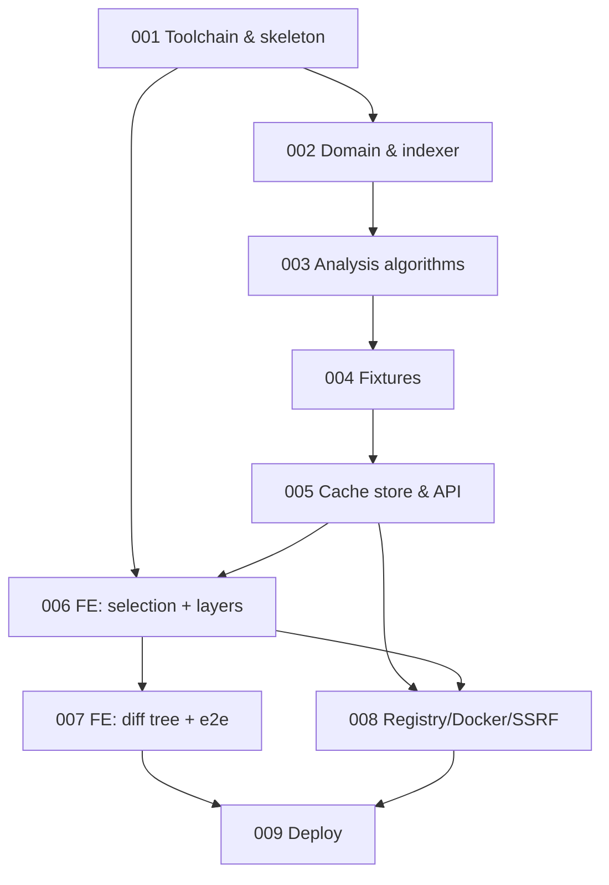

# IMPLEMENTATION.md — layerlens phased build plan

Inputs (binding, in precedence order where they overlap):
`.planning/PROJECT.md` → `.planning/RESEARCH.md` (Q9 supersedes Q5) →
`.planning/ARCHITECTURE.md` → `.planning/DESIGN.md` → `.planning/DECISIONS.md`.
Per-phase detail lives in `.planning/IMPLEMENTATION-phase-00N.md`.

## Build order rationale

Bottom-up along the dependency spine, demo-first, risk-last:

1. **Toolchain before code** — every later phase must end green under the same
   `mise` gates (build/lint/typecheck/test), so those gates exist first, with a
   walking skeleton proving the whole esbuild → `go:embed` → single-binary path.
2. **Pure algorithms before I/O** — `domain`/`analyze`/`index` have zero
   HTTP/gcr dependencies (ARCHITECTURE §2) and carry all the correctness-critical
   edge cases (whiteouts, opaque dirs, tarsum-v1 digest, LCP). They are fully
   table-testable from in-memory tars, so they land before any server exists.
3. **Fixtures early** — the deterministic OCI-layout generator (ARCHITECTURE §9.2)
   is the test substrate for every phase after it (cachestore, API, e2e). It comes
   immediately after the algorithms it validates.
4. **Golden demo as early as is honest** — phase 5 makes the demo *backend*
   fully servable (fixtures ingested at startup, layer-graph + tree APIs), and
   phases 6–7 build the two views on top, ending with the Playwright golden
   workflow passing against the real binary. At the end of phase 7 the
   PROJECT.md acceptance-criteria demo works end to end.
5. **Harden after it works** — registry pulls, SSRF transport, Docker-socket
   ingest, 25 GiB progress/cancel/resume are the risky, networked surface; they
   extend a working product rather than block it.
6. **Deploy last, as its own phase** (RESEARCH Q1): built and dry-run-verifiable,
   never executed against a real host.

LRU eviction lives in phase 5 (not the hardening phase) because it is a
`cachestore` behavior tested with tiny caps against fixtures (RESEARCH Q7's
testability requirement) — it needs no network to exist or to verify.

## Phase table (live status tracker — update `Status` during step 7)

| Phase | Name | Requirements covered (PROJECT.md) | Depends on | Status |
|---|---|---|---|---|
| 001 | Toolchain & walking skeleton | Technical design › Frontend (esbuild, `go:embed`); Testing, validation, toolchain (mise tools+tasks, golangci-lint, tsc, test runners) | — | **Complete** |
| 002 | Domain model & streaming layer indexer | Key req › 25 GiB support (streaming, no buffering); layer instructions (history mapping); could-be-shared basis (changeset digest); Technical design › pre-existing libs kept at the boundary | 001 | **Complete** |
| 003 | Analysis algorithms: squash, diff, aggregate, trunk, edges | Key req › layer comparison (trunk/fork), could-be-shared edges; filesystem diff (cumulative squash + whiteouts, folder aggregates) | 002 | **Complete** |
| 004 | Fixture generator & vendored demo images | Key req › Demo materials; Acceptance › pre-specified images available at start (per RESEARCH Q2); Out of scope › linux/amd64 only | 003 | **Complete** |
| 005 | Cache store, fixture ingestion & analysis API | Key req › cached-images source; Technical design › Backend (JSON API, server-side aggregation + pagination, durable cache, `/var/lib/layerlens/images`); RESEARCH Q7 (LRU + cap + refusal); Acceptance › startup loads examples | 002, 003, 004 | **Complete** |
| 006 | Frontend: app shell, selection view, layer comparison view | Key req › Image selection view (analyzed source, pair selection); Layer comparison section (trunk/fork tree, ownership, instruction tooltips, dotted edges, per-side selection); Technical design › Frontend (React, React Query, components, overflow, interactivity) | 001, 005 | Not started |
| 007 | Frontend: filesystem diff tree + golden-workflow e2e | Key req › Filesystem diff section (unified tree, disclose + drill down, colored/hatched, aggregates, human sizes, mini bars); Acceptance Criteria › golden workflow; RESEARCH Q12 column spec; Testing › Playwright e2e (local Mac, no CI/DinD) | 006 | Not started |
| 008 | Remote sources: registry pulls, Docker ingest, SSRF | Key req › Docker-socket source, registry source (5 registries), 25 GiB fetch with progress; Technical design › SSRF allowlist, docker export path; RESEARCH Q3/Q4/Q10 | 005, 006 | Not started |
| 009 | Deployment & release hardening | Deployment › systemd unit, `mise run deploy` (SSH transfer + systemctl), RESEARCH Q1 (env-parameterized, dry-run), Q6 (README exposure caveat) | 001–008 | Not started |

## Dependency graph

## Traceability matrix

Every requirement line in PROJECT.md's "Key requirements", "Acceptance
Criteria", "Technical design", "Testing, validation, toolchain", and
"Deployment" sections, mapped to its delivering phase(s). "Data" = the phase
that computes/serves it; "UI" = the phase that renders it.

### Key requirements

| Requirement | Phase(s) |
|---|---|
| Selection source 1: prior downloaded/analyzed/cached images | 005 (API), 006 (UI) |
| Selection source 2: local Docker socket, if it exists | 008 |
| Selection source 3: user-input refs from the 5 public registries; server fetch + analyze | 008 |
| Support up to 25 GiB images | 002 (one-pass streaming indexer, no buffering/extraction), 008 (streamed pulls, byte progress, cancel, per-layer resume) |
| Layer comparison: vertical tree, shared trunk → fork → two branches | 003 (LCP data), 005 (API), 006 (UI) |
| Layers clearly indicate owning image / shared | 005 (owner field), 006 (UI) |
| Dockerfile instruction per layer, tooltip/popover for long ones | 002 (history mapping §4.0), 006 (UI) |
| Could-be-shared layers → dotted line | 002 (tarsum-v1 changeset digest), 003 (edge computation §4.5), 006 (SVG dotted edges + honesty copy) |
| Select one layer per image (or one on shared trunk) to compare | 006 (selection model), 005 (`leftLayers`/`rightLayers` API) |
| Cumulative squashed filesystem at selected points, whiteouts applied as deletions | 003 (Squash §4.2), 005 (assembly + comparison LRU) |
| Tree view: disclose (triangle) AND drill down (re-root) | 007 |
| Unified diff view: additions/deletions as tree entries, colored and hatched | 007 |
| Per-folder aggregate sizes, file counts, and diff deltas | 003 (Agg §4.4), 005 (API), 007 (UI) |
| Human-readable sizes (14.3 MiB style) | 007 (client formats; bytes on the wire per §6) |
| Mini horizontal relative-size bars in tree AND layer views | 006 (layer bars), 007 (tree bars, `maxSiblingBytes`) |
| Demo materials: example images showing `.dockerignore` cache-invalidation lesson | 004 (generator + vendored fixtures), 005 (startup load, pinned) |
| Out of scope: linux/amd64 only, no Windows/multiplatform | 004 (fixture platform), 008 (`remote.WithPlatform`, save `--platform`) |

### Acceptance Criteria (for demo)

| Requirement | Phase(s) |
|---|---|
| On start, pre-specified images (incl. examples) are available (RESEARCH Q2: loaded from vendored fixtures, zero network) | 005 |
| Golden workflow: pick `example:v1`/`example:v2` → layer tree with shared+separate layers → select layer per branch → filesystem tree shows adds/removals of B vs A | 007 (Playwright test `golden-workflow`), built on 004–006 |

### Technical design

| Requirement | Phase(s) |
|---|---|
| HTTP server + JSON API powering an SPA | 001 (skeleton), 005 (real API) |
| Go backend (latest) | 001 |
| Connect to local docker socket, export images to disk path | 008 |
| Otherwise read previously processed images from `/var/lib/layerlens/images` | 005 (`--data-dir`, durable cache §5) |
| Server-side aggregation + pagination (by folder/depth) to bound payloads | 005 (§6.5: depth/limit/cursor/filter, `TreeAgg`) |
| Pre-existing libraries for image access, daemonless | 002 (stdlib tar core), 005 (gcr `layout`), 008 (gcr `remote`, moby client) |
| SSRF: only query a pre-specified registry list | 008 (imgref allowlist §7.1 + safehttp dialer §7.2) |
| Cache image data + analysis durably on local filesystem | 005 (§5 cache format, atomic writes, flock) |
| Cache cap + LRU eviction + oversize refusal (RESEARCH Q7) | 005 |
| TypeScript UI, esbuild bundle, `//go:embed` | 001 |
| Spacious layout; unmistakable interactivity (design/hover/cursor) | 006, 007 (per DESIGN §1, §6) |
| All text overflow handled (filenames, instructions, refs, sizes) | 006, 007 (DESIGN §3 strategies) |
| React + React Query; off-the-shelf component system | 006 (shadcn/ui + Radix + headless-tree per DECISIONS) |

### Testing, validation, toolchain

| Requirement | Phase(s) |
|---|---|
| Static analysis / typecheck / lint for both languages (golangci-lint incl. vet, tsc, eslint) | 001 (gates wired), enforced every phase via Definition of done |
| Go unit tests for all important functionality | 002, 003, 004, 005, 008 (table-driven per §9.1) |
| Client unit tests | 006, 007 (Vitest per §9.3) |
| Playwright integration tests, end-to-end | 007 (golden + degenerate + pagination), 008 (error paths, opt-in network smoke) |
| mise as toolchain manager and task runner | 001 (tools + tasks), 004 (`genfixtures`), 007 (`e2e`), 009 (`deploy`) |
| E2e runs locally on a Mac; no CI/DinD | 007 (fixtures-only webServer, no Docker/network), 008 (network/docker tests opt-in flags) |

### Deployment

| Requirement | Phase(s) |
|---|---|
| Linux amd64 target, systemd-supervised service | 009 (unit with hardening per RESEARCH Q6) |
| `mise run deploy`: SSH transfer of unit + app, `systemctl` restart | 009 (env-parameterized, documented dry-run per RESEARCH Q1; never run from sandbox) |

Nothing in the spec is unmapped. Two source-document discrepancies were found
during slicing and are assigned homes (see phase risks): the stale
`(Path, Kind, ContentSHA, Mode, LinkTarget)` serialization snippet in
ARCHITECTURE §3.1 that contradicts its own binding tarsum-v1 rule (fixed in
phase 002, delta noted in DECISIONS.md), and the tree name-filter's
"server-assisted beyond the loaded window" (DESIGN §5.3/§10.5) which has no
endpoint in ARCHITECTURE §6 (phase 007 ships the client-side filter over
loaded rows; any server search endpoint is a recorded delta if added).

## Definition of done (applies to every phase)

A phase is `Complete` only when all of the following hold:

1. `mise run build` succeeds from a clean checkout (Go build, esbuild bundle,
   Tailwind CSS, `go:embed` all green).
2. `golangci-lint run` (which includes `go vet`) reports zero issues; `gofmt`
   produces no diff.
3. `tsc --noEmit` and eslint are clean (from phase 006 on, or as soon as TS
   sources exist in the phase).
4. `mise run test` passes: all Go unit tests (`go test ./...`) and all Vitest
   suites, including every test enumerated in the phase file. Playwright suites
   pass from phase 007 on (`mise run e2e`).
5. No dangling `TODO`/`FIXME`/commented-out stubs for in-phase scope; anything
   deliberately deferred is named in a later phase's file, not left as a code
   comment.
6. If implementation contradicted DESIGN.md/ARCHITECTURE.md, the source file was
   updated and the delta recorded in DECISIONS.md (per PROJECT.md workflow).
7. The phase's row in the table above is updated (`In progress` when started,
   `Complete` when done).
8. A git commit (or small series) lands with the phase's work; the final commit
   message references the phase number.
